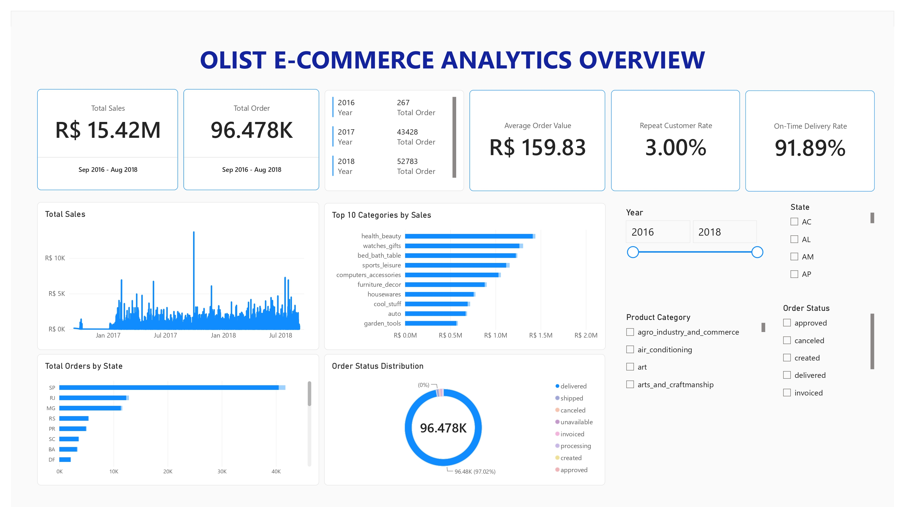

# Olist E-Commerce Analytics

An end-to-end e-commerce analytics project using **SQL, DAX, and Power BI** to analyze sales performance, customer behavior, product categories, and delivery performance using the Brazilian Olist e-commerce dataset.

## Project Overview

This project demonstrates a data analytics workflow from data cleaning and preparation in PostgreSQL to business analysis and dashboard development in Power BI.

The project focuses on answering questions such as:

* How are sales and order volumes changing over time?
* Which product categories generate the most sales?
* Where are customers located?
* How many customers make repeat purchases?
* How well are orders delivered compared with estimated delivery dates?
* What is the distribution of order statuses?

## Tools & Technologies

* **PostgreSQL** — data storage and SQL-based data cleaning
* **SQL** — data transformation and validation
* **Power BI** — data visualization and dashboard development
* **DAX** — business metrics and KPI calculations

## Dashboard

### Executive Overview

## Dataset

The project uses the **Brazilian E-Commerce Public Dataset by Olist**, containing information about orders, customers, products, sellers, payments, reviews, and related geographic data.

## Project Status

**In progress**

The Executive Overview dashboard has been completed. Further analysis of sales, customers, products, delivery performance, and customer satisfaction will be added to the project.
